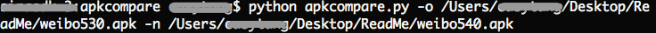

# ApkSizeCompare
Simple py script to check the change of apk size

-----
## Useage
1. Download it
2. Modify apkcompare/apk_tree. You can unzip the apk to specify the file. Formatting is encouraged. Weibo apk for example.
    
    ```
    
        {
            "AndroidManifest.xml":0,
            "classes.dex":0,
            "resources.arsc":0,
            "assets":{
                "appmarket.jar":0,
                "browser.jar":0,
                "composer.jar":0,
                ...
                }
        }
        
    ```

    file: 
        
    ```
    
        ...
        "AndroidManifest.xml":0
        ...
    
    ```
        
    floder:
        
    ```
    
        ...
        "assets":{
        ...
        }   

    ```
   
3. cd into the absolute path, run the py script with 
    
    ```
    
        '------------PyTest.py usage:------------'
        '-h, --help: print help message.'
        '-o, --old : input old apk file path'
        '-n, --new : input new apk file path'
        '----------------------------------------'
 
    ```
    
    Weibo apk for example:
    
    cd:
        
    
        
    command:
        
    

4. read output, weibo for wxample
    
    ```
    
        ============weibo530==============
        path:weibo530/resources.arsc    size:1.6 MB
        path:weibo530/assets    size:80.3 MB
        path:weibo530/assets/sync.jar    size:109.5 KB
        path:weibo530/assets/appmarket.jar    size:457.8 KB
        path:weibo530/assets/browser.jar    size:141.6 KB
        ...
        ============weibo530==============
        
        
        ============weibo540==============
        path:weibo540/resources.arsc    size:1.6 MB
        path:weibo540/assets    size:79.4 MB
        path:weibo540/assets/sync.jar    size:111.9 KB
        path:weibo540/assets/appmarket.jar    size:528.2 KB
        path:weibo540/assets/browser.jar    size:150.0 KB
        ...
        ============weibo540==============
        
        
        ============compare result==============
        file:sync.jar has changed 2.4 KB
        file:resources.arsc has changed 62.3 KB
        file:raw has changed 3 bytes
        file:drawable-hdpi has changed 202.7 KB
        file:layout has changed 16.6 KB
        file:lib has changed 1.7 MB
        ...
        ============compare result==============
    
    ```